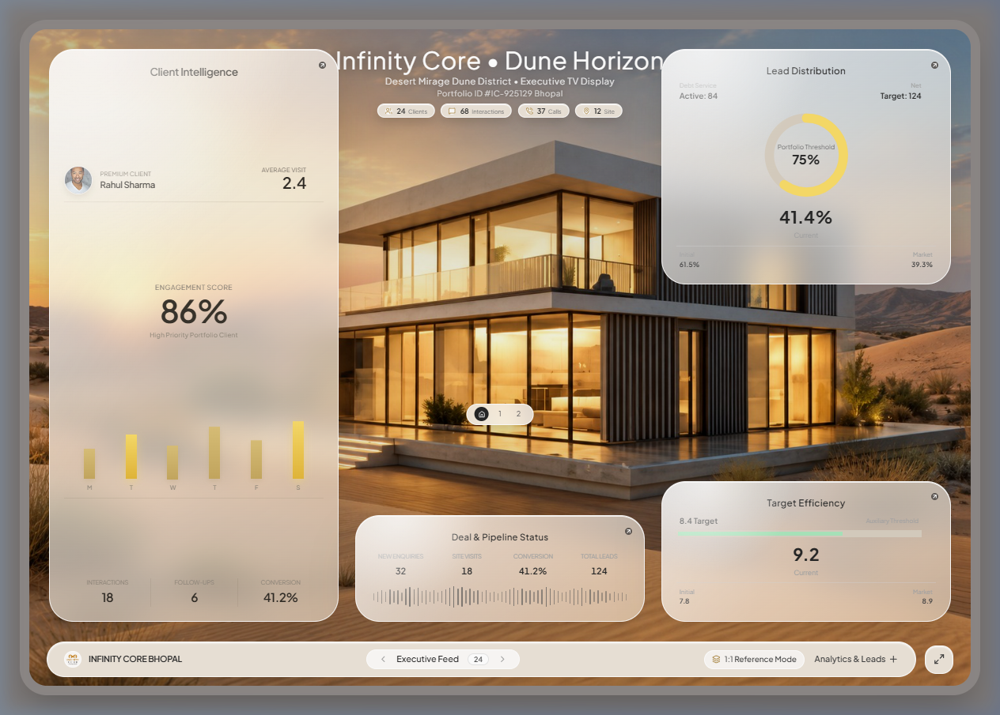

# Real Estate Glass UI Dashboard 🏡✨



Welcome to the **Infinity Core Bhopal - Executive TV Dashboard**. This project is a premium, real-time, TV-first executive analytics dashboard designed exclusively for luxury real estate operations.

## 🌟 Project Overview

This application transforms a static luxury design concept into a **fully functional, interactive React-based UI**. Built specifically for 16:9 4K TV displays, this dashboard brings data to life using advanced CSS **Glassmorphism**, SVG filtering, and smooth interactive animations. It is crafted to give executives at Infinity Core an at-a-glance, high-fidelity overview of site visits, client activities, pipeline status, and critical financial metrics.

## 🚀 Key Features

*   **Advanced Authentic Glassmorphism:** 
    Instead of relying on static blurred images, we engineered real, dynamic CSS glass panels using custom SVG Filters (`feTurbulence` and `feDisplacementMap`). This creates a highly realistic frosted glass texture that blurs, distorts, and reflects the background villa naturally.
*   **Live Executive KPIs & Financials:**
    Real-time tracking of Debt Service Coverage Ratios (DSCR), Loan-to-Value (LTV), active leads, and overall conversion probability.
*   **Interactive Client Intelligence Profiles:**
    Detailed client cards (e.g., "Rahul Sharma") featuring avatars, status tags, visit history, engagement scores, and conversion probability progress bars.
*   **Dynamic Data Visualizations:**
    Built-in custom Recharts-based visual graphs for Client Activity and Site Visit Performance, featuring custom tooltips, gradients, and a sleek dark-mode aesthetic.
*   **Pipeline & Lead Status Tracking:**
    A bespoke Donut chart pipeline visualization showcasing leads in Warm, Hot, and Closing stages.
*   **Real-time Clock & TV Mode:**
    Live ticking clock, date indicators, and a dedicated Fullscreen toggle optimized for TV displays.
*   **Sleek Navigation Dock:**
    A bottom navigation dock allowing users to slide between different data decks seamlessly.

## 🛠️ Technology Stack

*   **Frontend Framework:** React.js (Vite)
*   **Styling & UI:** Tailwind CSS (for rapid, responsive, and consistent styling)
*   **Animations:** Native CSS Transitions & Tailwind utility classes
*   **Icons:** Lucide React
*   **Data Visualization:** Recharts
*   **Effects:** Custom SVG Filters (for authentic frosted glass)

## 📁 Project Structure

```text
src/
├── assets/             # Images, logos, icons, and background visuals
├── components/
│   ├── common/         # Reusable UI elements (Badges, GlassCard wrappers)
│   └── dashboard/      # Specific dashboard widgets (Header, KPI Cards, Charts, Dock)
├── data/               # Mock data structures (dashboardData.js) - Ready for API integration
├── pages/
│   └── Dashboard.jsx   # The main TV dashboard layout assembling all components
├── App.jsx             # Main application entry point
├── index.css           # Global styles and custom CSS for SVG filters
└── main.jsx            # React DOM rendering
```

## ⚙️ How to Run Locally

1. **Clone the repository:**
   ```bash
   git clone https://github.com/pranavsahu005/real-estate-glass-ui-dashboard.git
   cd real-estate-glass-ui-dashboard
   ```

2. **Install dependencies:**
   ```bash
   npm install
   ```

3. **Start the development server:**
   ```bash
   npm run dev
   ```

4. **View in browser:**
   Open your browser and navigate to `http://localhost:5173`. We highly recommend using Fullscreen mode for the intended TV experience!

## 🔮 Future Roadmap

*   **Supabase Backend Integration:** Connect the existing frontend components to a live Supabase database for real-time analytics streaming.
*   **Authentication:** Add secure login for executives to protect sensitive financial data.
*   **Remote Control Navigation:** Enhance the UI to support physical remote controls for office TV setups.

---
*Built with precision and designed for luxury.*
